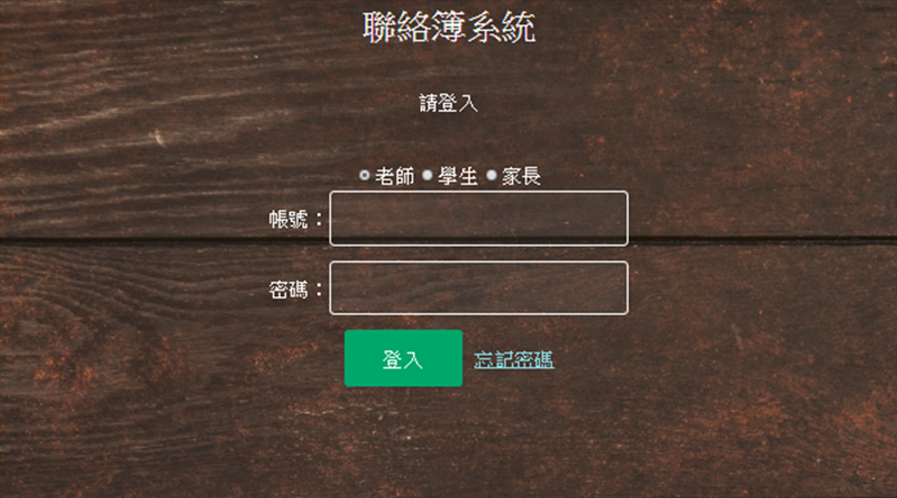
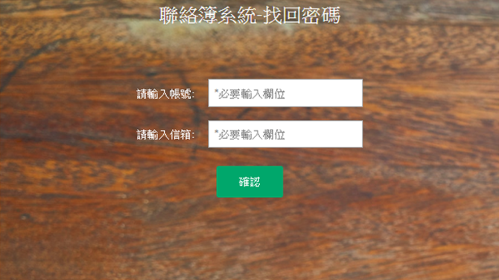
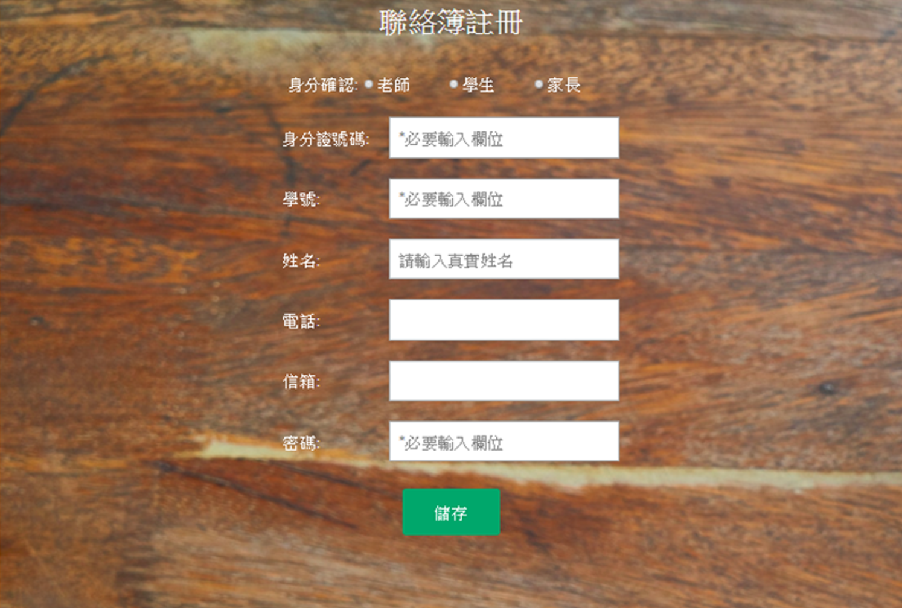

# Contactbook
### 聯絡簿系統
## 網頁畫面
- 登入主畫面：    
使用者必須先行選擇身分進行登入，不同身分擁有的權限不同。帳號與電子信箱有區分，帳號為學校給予之編號(如:教職員編號、學號等)。若身分、帳號或密碼其中一項有誤，不會額外提示是哪一項的錯誤。
 

- 找回密碼頁：  
填寫當初註冊的資料，認證身分成功後便能找回密碼。若輸入錯誤的資料將會跳出提示，請使用者檢查。
 

- 帳號註冊頁：  
只有老師身分才能進行帳號註冊，必須登入老師身分才能進入此畫面。填寫基本資料進行註冊。會檢查輸入資料是否有空值或帳號、身分證號重複，有誤將跳出提示。
 

- 系統畫面：    
依照不同身分轉跳不同的畫面。學生與家長的系統畫面一樣，但能夠填寫的欄位不同。唯獨老師的系統畫面可以選擇學生，並在最下方的註冊按鈕才能進入帳號註冊頁。    
同一個學生的聯絡簿內容都能被相關家長和老師看到，但學生只能看到自己的。內容會隨不同使用者更動而改變，所有更動都會被所有權限的使用者看到。

| 學生、家長系統畫面 | 老師系統畫面 |
| -------------- | --------- |
| **學生**只能新增、修改、查詢、刪除**生活札記與上課筆記**。**家長**只能新增、修改、查詢、刪除**家長評語**。 | **老師**只能新增、修改、查詢、刪除**今日作業與老師評語**。 |
|  |  |


## API使用
連接資料庫並針對連線問題偵錯。資料庫在本地端電腦上的MySQL，資料庫名稱為**contactbook**。
```php
session_start();
$dbconnect = @new mysqli("localhost", "contactbook", "123", "contactbook");
if($dbconnect->connect_errno != 0){
    ...
    exit();
}
```
資料庫資料庫編碼格式必須為**utf8mb4**，無法設定自碼格式會跳轉回登入首頁。
```php
$sql = "set names utf8mb4"; 
$result = $dbconnect->query($sql);
if($result !== TRUE){
    ...
}
```
根據不同身分跳轉視窗。
```php
function IDA($identity){
    ...
}
```
查詢學生資料表的姓名，並顯示在老師網頁中的學生名單上。
```php
$sql = "select * from student where tid='$account'";
$seldata = $dbconnect->query($sql);
if(($seldata->num_rows) > 0){
    if(isset($_SESSION["classlist"]) && ($_SESSION["classlist"]!=NULL)) {
        unset($_SESSION["classlist"]);
    }
	while(($row=$seldata->fetch_array(MYSQLI_ASSOC)) != NULL){
        $id=$row["id"];
        $name=$row["name"];
        $classlist.="<option value='$id'>$name</option>";
    }
    $_SESSION["classlist"]=$classlist;
}
```
每次查詢完畢必須釋放查詢完成的資料。
```php
function freesql($sql){
    if(isset($sql) && is_resource($sql)){
        mysqli_free_result($sql);
    }
}
```
查詢資料並存放session，檢查是否有值，有值的話就清空。
```php
function sessiondb($dbconnect, $sql, $rowdata){
    ...
}
```
取得登入頁身分、帳號、密碼資料，不可有空值或輸入不正確，否則會退回登入頁。
```php
if(isset($_POST["loging"]) && ($_POST["loging"]=="登入")){
    if(isset($_POST["account"]) && ($_POST["account"]!=NULL)){
        if(isset($_POST["password"]) && ($_POST["password"]!=NULL)){
            $identity=trim($_POST["identity"]);
            $account=trim($_POST["account"]);
            $password=trim($_POST["password"]);
            ...
        }
```
家長和學生依照日期查詢聯絡簿，老師根據選擇的日期與學生查詢聯絡簿。不同的身分有不一樣的搜尋方式。
```php
elseif(isset($_POST["search"]) && ($_POST["search"]=="查詢")){
    if(isset($_POST["date"]) && ($_POST["date"]!=NULL)){
        $date=$_POST["date"];
        ...
    }
    if($_SESSION["identity"]==="teacher"){
        if(isset($_POST["ChoiceStudent"]) && ($_POST["ChoiceStudent"]!=NULL)) {
            $selstudent=$_POST["ChoiceStudent"];
            ...
        }
    elseif($_SESSION["identity"]==="student"){
        ...
    }
    else{
        ...
    }
}
```
按照選擇的日期及學生存入聯絡簿資料。不論成功與否都會跳出提示通知。
```php
elseif(isset($_POST["save"]) && ($_POST["save"]=="儲存")){
    ...
}
```
刪除資料會按照身分權限進行，只能刪除自身權限能更動的資料。不論成功與否都會跳出提示通知。
```php
elseif(isset($_POST["delete"]) && ($_POST["delete"]=="刪除")){
    ...
}
```
帳號註冊會檢查所有填寫資料欄位皆不可有空值，不論成功與否都會跳出提示通知。
```php
elseif(isset($_POST["register"]) && ($_POST["register"]=="註冊")){
    ...
}
```
找回密碼必須輸入正確的帳號和Email，否則要求重新輸入。
```php
elseif(isset($_POST["findpassword"]) && ($_POST["findpassword"]=="確認")){
    ...
}
```
關閉資料庫連線。
```php
mysqli_close($dbconnect);
```

## 版本
- OS Windows 10
- HTML 5
- PHP 7.2.x
- jQuery 1.11.3
- Bootstrap 3.3.7
- Wampserver 3.1.3 (mySQL)
